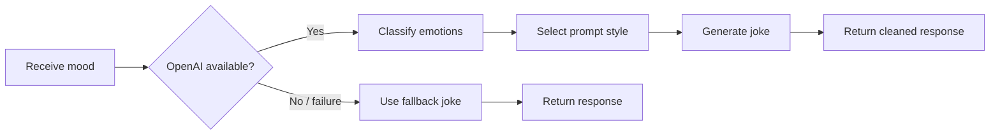
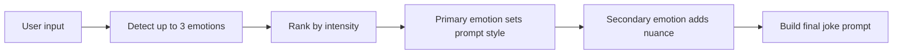

# Mood Joke Generator

Mood Joke Generator is a small web app that turns a user's mood into a short, warm, personalized joke.

The experience is designed to feel calm and lightweight:
- enter a mood
- generate a joke
- get a soft, human-feeling response
- quickly try again with a different mood

## What It Does

- Accepts a free-text mood input from the user
- Sends the mood to a server-side API route
- Uses AI to detect up to 3 emotions with intensity scores
- Selects the joke prompt style from the primary emotion
- Uses a secondary emotion, when present, to add nuance
- Generates a short joke tailored to the user's emotional mix
- Falls back to a local rule-based joke if the AI request fails

## User Flow


## API Flow



## Emotion Analysis Flow



## Project Structure

```text
app/
  api/generate-joke/route.ts   # API route for emotion analysis + joke generation
  globals.css                  # Global styles
  layout.tsx                   # App shell
  page.tsx                     # Home page

components/
  JokeCard.tsx                 # Joke display card
  MoodJokeGenerator.tsx        # Main input + interaction flow

lib/
  joke-generator.ts            # Rule-based fallback joke generator
```

## Screenshots

### Joke Result


## Local Setup

1. Install dependencies:

```bash
npm install
```

2. Create your local environment file:

```bash
cp .env.example .env.local
```

3. Add your OpenAI API key to `.env.local`:

```bash
OPENAI_API_KEY=your_openai_api_key_here
```

4. Start the development server:

```bash
npm run dev
```

5. Open:

```text
http://localhost:3000
```

## Environment Variables

- `OPENAI_API_KEY`
  Used only on the server in the API route.

`.env.local` is ignored by git, so your local secret is not committed.

## Fallback Behavior

If OpenAI is unavailable, the app still returns a joke by using the local rule-based fallback in [`lib/joke-generator.ts`](./lib/joke-generator.ts).

This helps ensure the user almost always gets a result instead of a dead end.

## Notes

- The UI is intentionally minimal and calm
- Joke generation is short by design: 1-2 lines
- Emotion analysis and prompt selection happen server-side before the final joke is generated
- Primary emotion drives the humor tone, while secondary emotion adds nuance
